# Impossible Wireframe

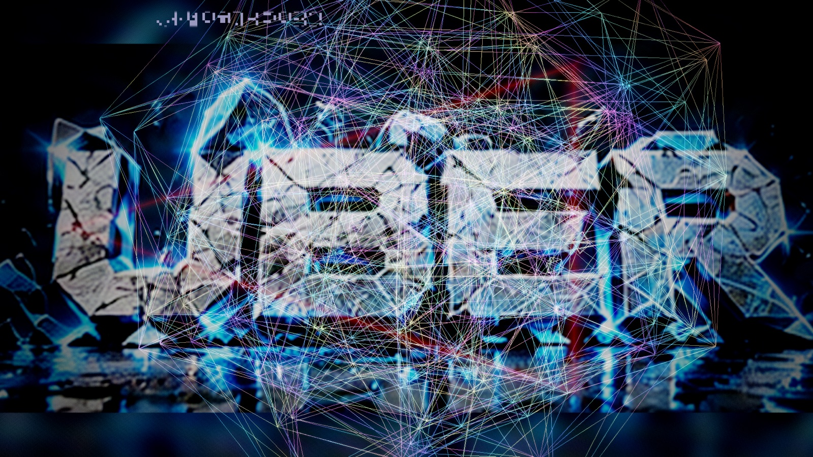

**A real-time wireframe demoscene in C++20 and OpenGL 4.1 Core** for macOS, Linux and Windows. It renders 51 mathematically unusual objects, from exact 4D polychora to minimal surfaces, strange attractors and procedurally discovered shapes. A HDR post pass composites them over a full-screen logo show, and a tracker module drives the motion.

Copyright (c) 2026 Ulf Bertilsson. Code is MIT licensed. Tags: `wireframe` `demoscene` `opengl` `glfw` `cpp20` `4d-geometry` `procedural-geometry` `shaders` `libopenmpt` `tracker-music` `creative-coding` `macos`.

## Highlights
- **51 scenes**: the 600-cell, its exact face-plane slice, the dual 120-cell, tesseract, Hopf fibres, Boy surface, Klein bottle, Dini surface, TPMS, Clifford torus, quaternion-Julia slice, Lissajous and chaotic attractors, and 10 procedural "unknown lab" objects.
- **Effect engine**: 64 CPU vertex-warper effects, 24 curated multi-stage recipes and a deterministic mutation generator. Every stage is fail-safe, so a bad combination restores the previous mesh instead of blanking the scene.
- **Logo show**: 20 full-screen UBER cards fade in, hold for a few seconds, fade out, then give way to a long black break where the wireframe has the screen to itself.
- **Arty black breaks**: when the logo is away, a procedural art layer fades in (domain-warped neon ink, beat-lit cracked-glass Voronoi, kaleidoscopic rose rings), slowly cross-fading between styles.
- **Living 3D background**: a raymarched metaball organism that melts and breathes with the music, over uneven, morphing art fields.
- **Eye candy**: anamorphic blue lens streaks and radial light rays from bright wires, plus lensing, shockwave and chromatic aberration that fade in as the logo fades out.
- **HDR pipeline**: RGBA16F target, additive line blending, bloom, lensing, chromatic aberration, glitch slices, grain and an ACES tone map. Logo-aware gain keeps wires readable and the logo unwashed.
- **Music-reactive**: SDL2 and libopenmpt play a bundled public-domain MOD. Bass, mid and treble bands drive glow, bloom and the effect system. Without audio, a deterministic BPM clock takes over.
- **Tested**: geometry validity, canonical V/E/F counts, a recipe-validity regression over every recipe, and timeline math, all built with `-Wall -Wextra -Wpedantic -Werror`.

## Screenshots
Captured with `--window 960x540 --screenshot PATH --frames N`.

| | |
|---|---|
| 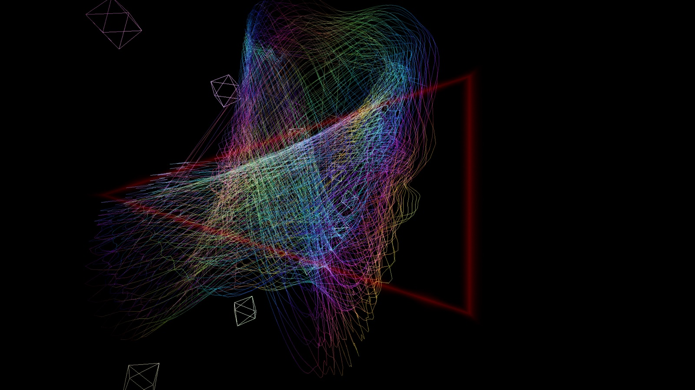 | 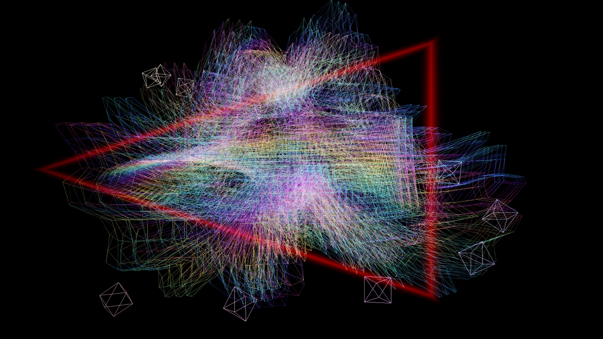 |
| Hopf fibres, warped by an effect recipe, with travelling octahedra | Seeded harmonic "discovered object" under heavy effect layering |
| 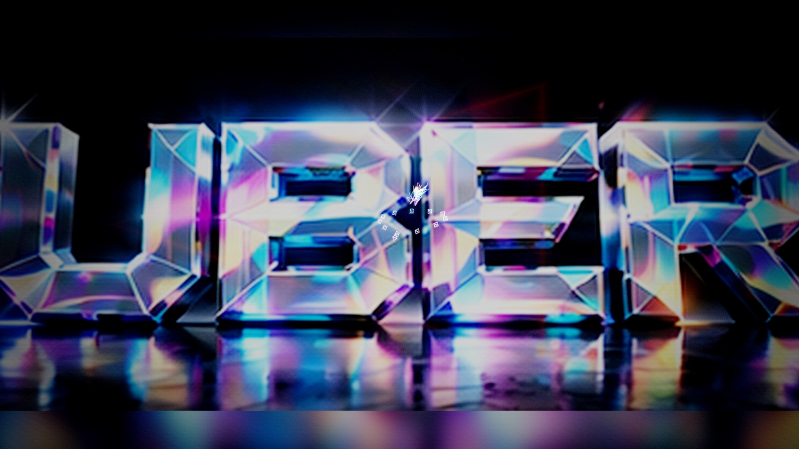 | 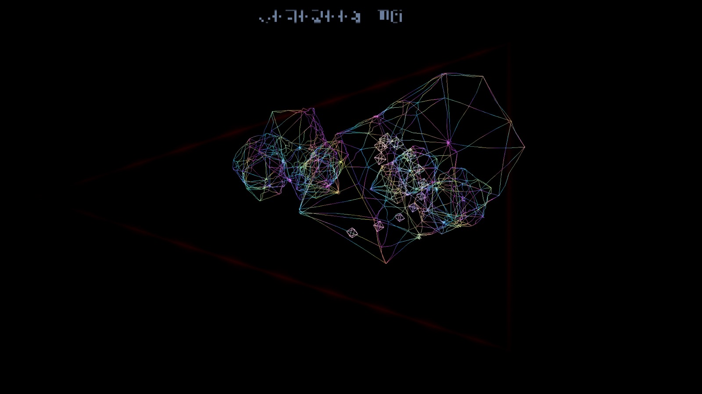 |
| Logo hold: the UBER card at full screen, the wireframe dimmed | Fade transition between logo and black break |
| 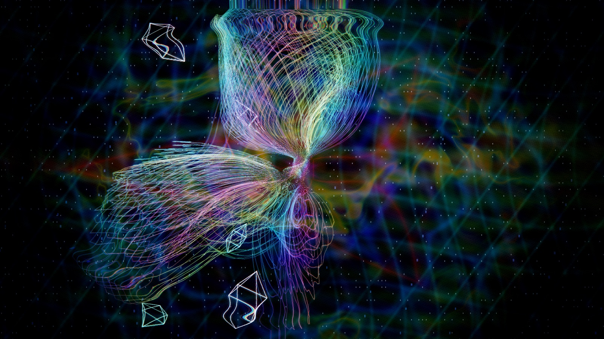 | 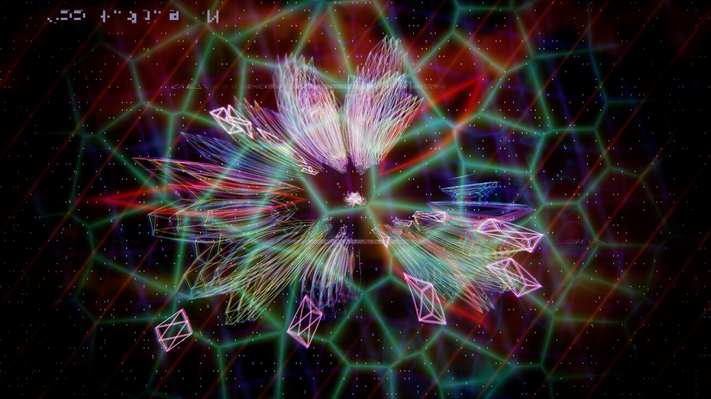 |
| Black-break art layer: neon ink filaments | Black-break art layer: beat-lit cracked glass |
| 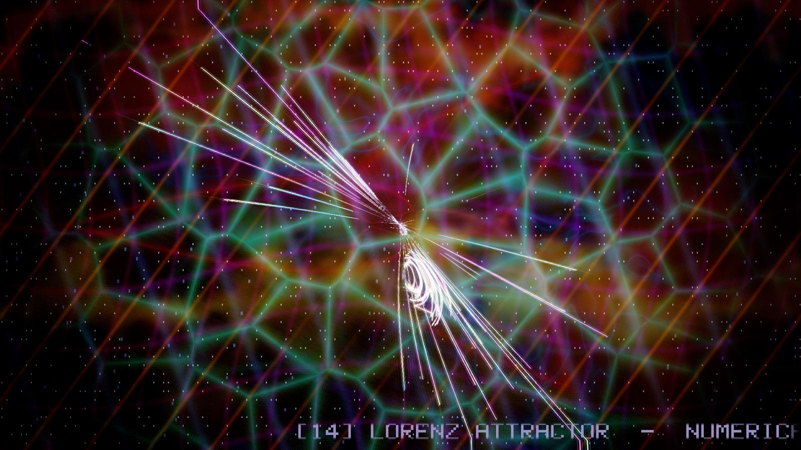 | 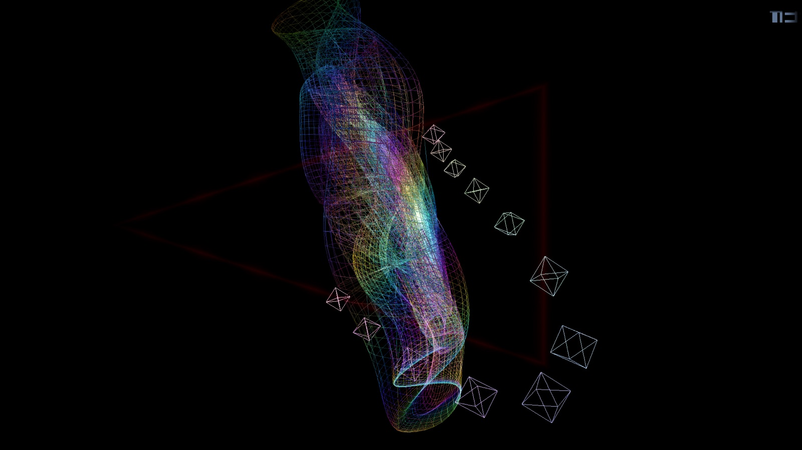 |
| Beat-synced scroller ticker at the bottom | Klein bottle immersion |
| 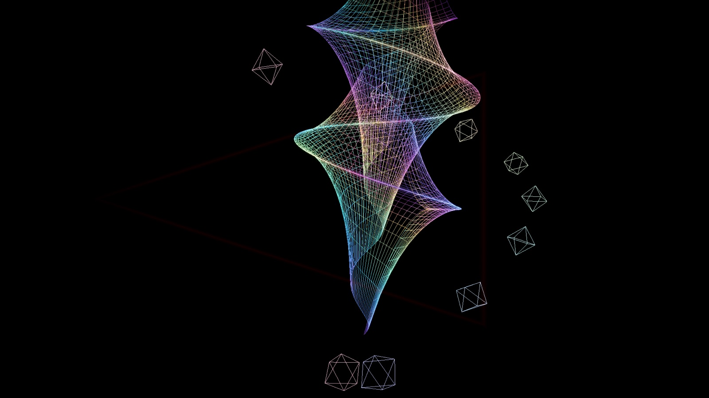 | 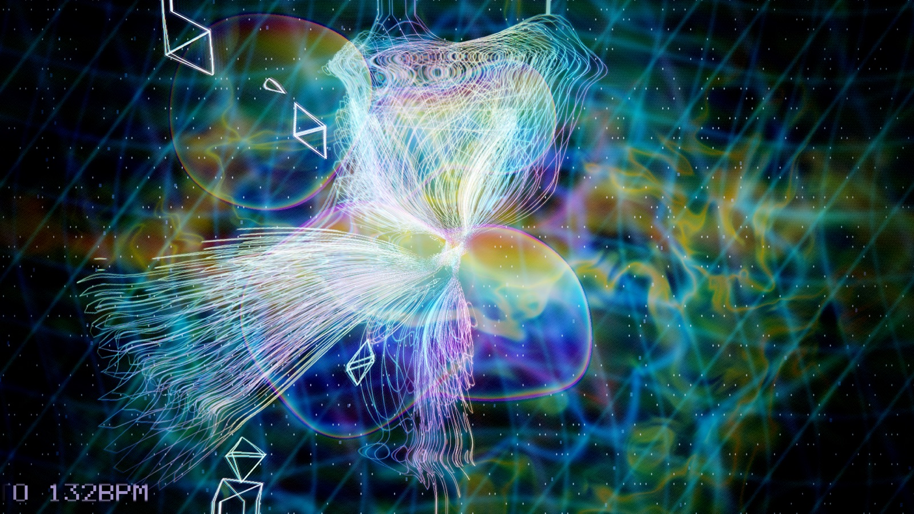 |
| Dini surface | Breathing 3D metaball organism in the black break |

## Implemented scenes
The show contains 51 validated scenes. Exact or derived scenes include the 600-cell projection, the exact 600-cell face-plane slice and the dual-derived 120-cell projection. Parametric and numerical scenes include TPMS surfaces, Hopf fibres, Boy surface, superformula, Clifford torus, quaternion-Julia boundary slice, Lissajous and chaotic attractors, 25 v4 exotic geometry families and 10 ported unknown-lab procedural wire objects.

`data/object_catalog.csv` records provenance. The hyperbolic and quaternion scenes are visualizations, not claimed canonical honeycomb or fractal meshes.

## Logo show timing
The logo cycle is time-driven and independent of the scene sequencer, 14.5 s per card:

| Phase | Duration |
|---|---|
| Fade in | 1.0 s |
| Hold | 3.5 s |
| Fade out | 1.0 s |
| Black break | 9.0 s |

During the hold, wire gain and post-pass exposure are reduced slightly so the logo stays rich and the wireframe stays visible. During the black break the wireframe is shown at full gain.

## Build
The build system is CMake. A `Makefile` wraps it for convenience — the
simplest path is just:

```sh
make            # configure (if needed) + build (Release, parallel)
make test       # build + run the geometry/scroller tests
make run        # build + launch (default music, 132 bpm)
make run-pulse  # launch with the CC0 Wireframe Pulse track
make diag       # dump the resolved toolchain (SDK, GLFW, SDL2, openmpt)
make clean      # remove the build/ directory
make reconfigure# wipe build/ and reconfigure (recover from a stale cache)
```

The Makefile auto-reconfigures when `CMakeLists.txt` or the build type changes
(a stamp file tracks this), so a stale cache rarely needs manual cleanup. To
pin a specific macOS SDK or enable strict warnings:

```sh
make reconfigure CMAKE_EXTRA=-DIW_SYSROOT=$(xcrun --show-sdk-path)
make CMAKE_EXTRA=-DIW_WARNINGS_AS_ERRORS=ON
```

Or use CMake directly (macOS via Homebrew):

```sh
brew install cmake glfw
cmake -S . -B build -DCMAKE_BUILD_TYPE=Release
cmake --build build -j
ctest --test-dir build --output-on-failure
./build/impossible_wireframe --bpm 132
```

Optional audio playback (libopenmpt + SDL2) is detected automatically; on
macOS add `brew install sdl2 libopenmpt`. Linux: install a C++20 compiler,
CMake, OpenGL development headers and GLFW3 development package, then use the
same commands (or `make`).

> **macOS build notes**
> - If you hit `No rule to make target '.../MacOSX.sdk/System/Library/Frameworks/OpenGL.framework'`,
>   your `build/` was configured against an SDK path that no longer exists (stale
>   CMakeCache). Just run `make reconfigure` (it wipes `build/` and reconfigures) —
>   the Makefile's `configure` target does this automatically now.
> - If you hit `tapi error: malformed file .../libSystem.B.tbd ... unknown
>   architecture` (or `OpenGL.tbd`, `libc++.tbd`) — even during CMake's compiler
>   check — your active `ld` can't parse the selected SDK's `.tbd` stubs. This
>   is usually a stale/mismatched CLT SDK (a removed CLT install, or a CLT
>   newer than the installed Xcode/ld). Fix: `make reconfigure` (CMakeLists now
>   pins `CMAKE_OSX_SYSROOT` to `xcrun --show-sdk-path` and `CMAKE_OSX_ARCHITECTURES`
>   to the host arch before `project()`). If a different SDK is needed:
>   `make reconfigure CMAKE_EXTRA=-DIW_SYSROOT=$(xcrun --show-sdk-path)`. As a
>   last resort, align the toolchain: `sudo xcode-select -s /Library/Developer/CommandLineTools`
>   (or an Xcode path) so the ld and SDK come from the same install.
> - On Apple the project links a real `libOpenGL.dylib` when available, else
>   `-framework OpenGL` (never the `OpenGL::GL` SDK-baked path), and adds the
>   OpenGL include dir so `<OpenGL/gl3.h>` resolves without relying on
>   toolchain-default SDK search.

If OpenGL/GLFW are absent, CMake still builds `iw_geometry` and `geometry_tests`, allowing headless CI validation.

## Controls
- Left / Right: previous / next scene and enter manual scene mode
- Space: return to automatic beat/bar scene sequencing
- T: toggle the text scroller
- R: toggle the effect-recipe mode (auto per-scene curated+mutation <-> a fixed curated recipe)
- Up / Down: in recipe mode, cycle the 24 curated effect recipes
- P: re-roll the mutation seed (new procedural variant for the current scene)
- Escape: quit
- `--bpm N`: synchronization tempo (default 132) — also syncs the post-pass beat pulse
- `--no-scroller`: start with the text marquee off (toggle back on with T)
- `--recipe N`: start in recipe mode with curated recipe N (0–23)
- `--quality F`: render the HDR target (3D + post/FX) at F of screen resolution
  (0.25–1.0, default 1.0). Lower values are much faster on weak GPUs; the result
  is upscaled to the window. e.g. `--quality 0.5` renders at half resolution.
- `--no-post`: skip the screen-space FX (lensing, shockwave, glitch, grain,
  procedural background, …). The 3D wireframe + logo + travelers are still
  composited and tone-mapped; only the Uber-compositor effects are skipped.
  Useful for debugging and for maximum frame rate.
- `--window WxH`: initial window size, e.g. `--window 1920x1080` (default
  1440x900; valid range 320x200 .. 3840x2160).
- `--fullscreen`: start full-screen on the primary monitor at its native
  resolution, uncapped refresh (overrides `--window`).

## Visual layers
The renderer composites four layers, back to front:
1. **Logo backdrop** — on the timed show above, the 20 `UBER_Fullscreen_Logo_Pack/UBER_*_1920x1080.jpg`
   cards as a full-screen texture, drawn FIRST (as the opaque background) into
   the HDR buffer so the wireframe + travelers glow additively on top. It
   crossfades as the scene changes and has a subtle Ken Burns zoom +
   beat-reactive brightness. Cards are found automatically relative to the
   executable (or CWD), so the folder just needs to sit next to the binary.
2. **Wireframe** — the 51 scenes with beat-reactive breathing scale, camera
   drift and morphing.
3. **Traveling objects** — 12 small octahedra weaving back and forth through
   the wireframe (depth-sorted, so they pass in front of and behind the mesh).
4. **Effect warp** — the CPU effect system (64 vertex-warper effects + 24
   curated multi-stage recipes + a deterministic procedural "mutation"
   generator) re-shapes the active mesh every frame, driven by the music
   pulse and bass/mid/treble/beat bands. When audio is active the real
   decoded bands drive the audio-reactive effects; otherwise synthetic sine
   bands are used. In auto mode each scene gets a curated recipe (rotated by
   scene index) overlaid with a deterministic mutation for per-frame variety;
   press R for a fixed recipe (Up/Down to cycle), P to re-roll the mutation
   seed, or `--recipe N` to start in recipe mode. The system is fail-safe: any
   stage that leaves the mesh empty or invalid restores the previous frame, so
   a bad combo never blanks the scene.
5. **Screen-space FX (post pass)** — the Uber compositor's signature effects
   run over the combined logo + wireframe + travelers frame: gravitational
   lensing (1/r^2), a refractive shockwave ring, chromatic aberration, barrel
   breathing, an SDF nested-triangle energy sculpture, holographic spectral
   interference, beat-gated glitch slices, scanlines, film grain, and an ACES
   filmic tone map — all reactive to the beat/music level.
 6. **Text scroller** — a beat-synced news-ticker band at the bottom of the
    screen (6x font, larger and more readable than before). It scrolls
    leftward and flashes on each downbeat. The line shows the scene index,
    name, provenance, the active effect-recipe name, and the BPM, e.g.
    `[03] Tesseract - 4D hypercube  *  Singularity Bloom  132BPM`. On by
    default; toggle with T.

All layers are best-effort: if a shader fails to compile or the logo pack is
missing, the app degrades (no background / no travelers / no FX) rather than
crashing.

## Music

The repo includes Drozerix — **Silicon Dancer** (`MOD`), listed by the Quinlight Audio project as Public Domain, for immediate local playback. The fetcher can refresh the same file if needed:

```sh
python3 assets/music/fetch_other_music.py
./build/impossible_wireframe --music assets/music/drozerix_-_silicon_dancer.mod --bpm 132
```

When SDL2 and libopenmpt are available, the module plays locally and its decoded energy drives line glow, bloom intensity, timeline seconds, and background motion. Without those dependencies, the demo remains deterministic from its BPM clock.

## Correctness gates
Project targets compile with `-Wall -Wextra -Wpedantic -Werror` (or `/W4 /WX`). Tests assert canonical V/E/F counts for tesseract, 16-cell, 24-cell, 600-cell and V/E for the dual 120-cell; exercise every procedural family; reject non-finite vertices, invalid indices, self-edges and duplicate edges; and verify timeline beat/bar math.

## Architecture
- `Geometry.*`: canonical polychora, projections, slicing, base parametric surfaces, validation.
- `AdvancedGeometry.*`: TPMS extraction, dual 120-cell, quaternion boundary lattice, hyperbolic visualization, attractors, v4 exotic families, unknown-lab adapters and deterministic discovery.
- `Scene.*`: scene catalogue, provenance and update-rate cache. Expensive implicit/fractal geometry is not rebuilt at video refresh rate.
- `Timeline.*`: deterministic BPM/beat/bar synchronization.
- `Effects.*`: 64 CPU vertex-warper effects, 24 curated multi-stage recipes and
  a deterministic procedural recipe generator, driven by time + audio bands
  (real decoded bass/mid/treble when audio is active, synthetic sines
  otherwise); fail-safe (restores the mesh on any invalid stage). Edge-growth
  capped at 50k for heavy subdivision effects. Ported from the
  unknown-wireframe-lab v5/v6 compositor.
- `Audio.*`: SDL2 + libopenmpt module player with a 3-band one-pole IIR
  band-split (bass <350 Hz, mid 350–3000 Hz, treble >3000 Hz) computed in the
  audio callback and exposed atomically to the render thread.
- `Renderer.*`: OpenGL 4.1 indexed line renderer with checked external GLSL compilation/linking, reusable buffers, RGBA16F HDR render target, shader composite, breathing size cycle, zoom/flyover camera choreography and guarded framebuffer setup. In logo mode the frame (logo + wireframe + travelers) is captured to the HDR target and passed through the post/FX shader.
- `shaders/post.*`: RGBA16F HDR-style composite pass with procedural background,
  glimmer, bloom-like highlight shaping, plus the Uber-compositor screen-space
  FX (gravitational lensing, refractive shockwave, chromatic aberration,
  barrel breathing, SDF triangle, holographic interference, glitch slices,
  scanlines, grain, ACES tone map) and music-reactive light.
- `shaders/wire.*`: object-space wire color cycling, lighting-matrix bands and
  music-reactive electric edge highlights.

See `design.md` for mathematical provenance and design constraints.
See `docs/EFFECTS.md` for the implemented effect catalogue.

## Troubleshooting
- **Shader edits have no effect**: shaders are copied to `build/shaders` at build time, so run `make` after editing them.
- **Static GLFW link errors on macOS**: CMake searches for `glfw` and `glfw3` and adds the Apple frameworks when linking statically.
- **No audio**: install SDL2 and libopenmpt (`brew install sdl2 libopenmpt`). Without them the demo runs on the BPM clock.
- **Weak GPU**: use `--quality 0.5` or `--no-post`.

## Release notes
### v4.32
- Living background: a raymarched 3D metaball organism that melts, breathes with the beat and music, and is lit with fresnel and specular; the whole art field now swells and shears like tissue, with drifting light pools for an uneven look.

### v4.31
- First release where the scroller fix and the updated shader test are both in and the suite passes. v4.29 and v4.30 were tagged with that one test failing.

### v4.30
- Tag only; superseded by v4.31.

### v4.29
- Fixed the text scroller: it was upside-down at the top of the screen with corrupted glyphs (inconsistent font table, wrong code-strip texel mapping, inexact `pow(2,bit)`). It is now a crisp ticker at the bottom with a clean 5x7 font.

### v4.28
- Arty procedural background layer and anamorphic streak / light-ray eye candy in the post pass; new `uLogoVis` uniform fades them against the logo show.

### v4.27
- Fixed hangs: a false GLFW context-lost check caused per-frame reinitialisation, and a rejected mesh with duplicate edges ended the show. `sanitize()` now removes duplicate, self and out-of-range edges, with a regression test.
- Logo now renders the right way round and fills the screen.
- New timed logo show with fades and long black breaks.
- Wire gain scaled by edge count, and a reduced bloom, exposure and gamma lift over the logo, so the logo and wireframe are no longer washed out.
- `--screenshot` now flushes stale GL errors, and `--frames N` captures on frame N.
- macOS fixes: no `glTexStorage2D` (GL 4.2), GLFW static link.
