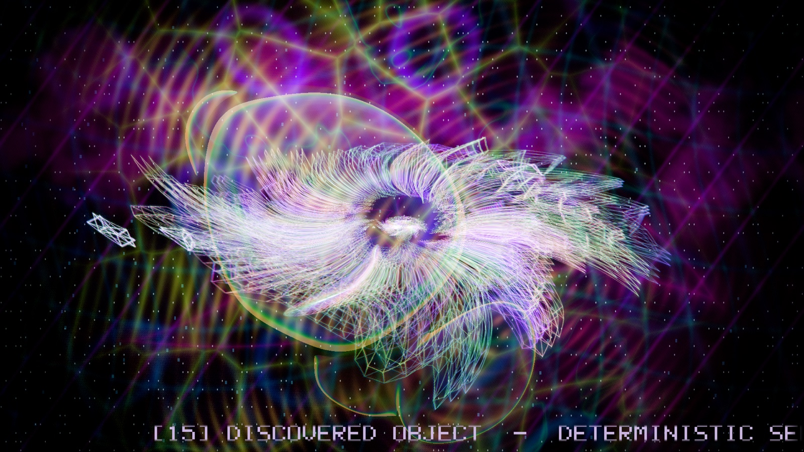
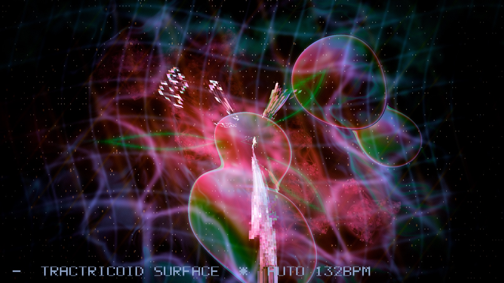
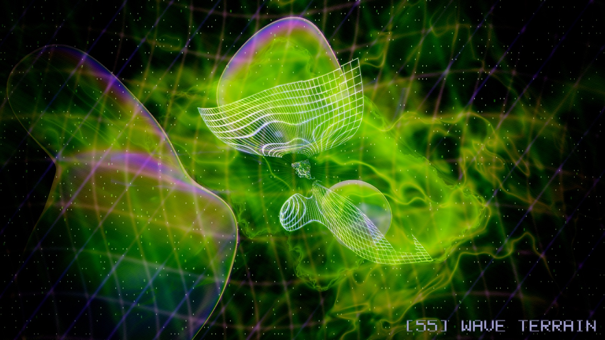
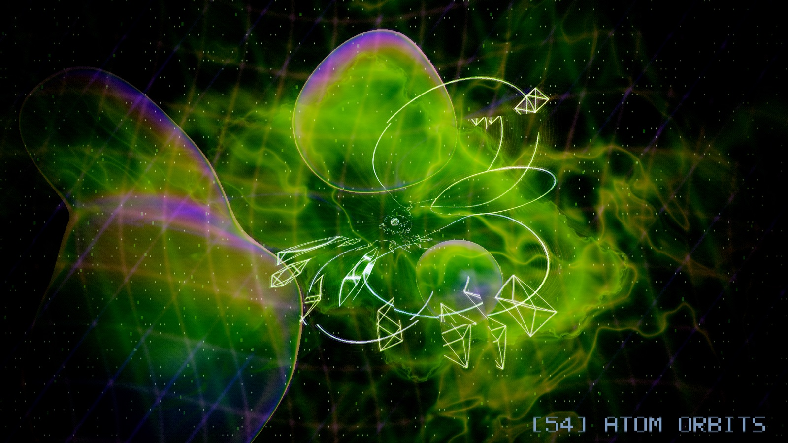
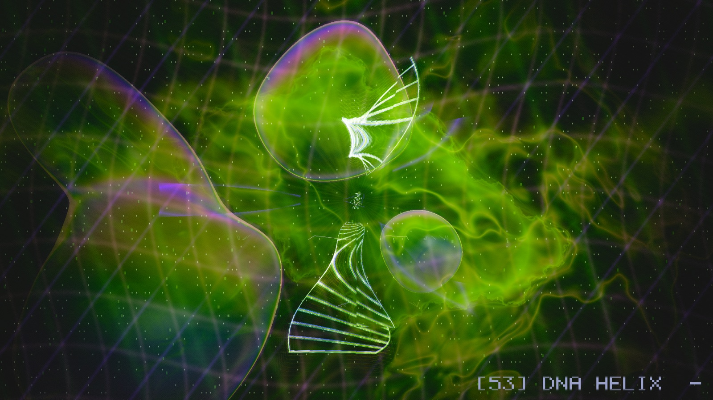

# Impossible Wireframe


**A real-time wireframe demoscene in C++20 and OpenGL 4.1 Core** for macOS and Linux. It renders 57 mathematically unusual objects, from exact 4D polychora to minimal surfaces, strange attractors and procedurally discovered shapes. A CPU effect engine warps them, an HDR post pass composites them over a timed logo show and a procedural art background, and a tracker module drives the motion.

Copyright (c) 2026 Ulf Bertilsson. MIT licensed. Current version: **v4.34**.
Topics: `wireframe` `demoscene` `opengl` `glfw` `cpp20` `4d-geometry` `procedural-geometry` `shaders` `libopenmpt` `tracker-music` `creative-coding` `macos`

**Contents:** [Quick start](#quick-start) | [Feature guide](#feature-guide) | [Screenshots](#screenshots) | [Controls and options](#controls-and-options) | [Build](#build) | [Tests and CI](#tests-and-ci) | [Repository layout](#repository-layout) | [Troubleshooting](#troubleshooting) | [Changelog](#changelog)

See also: [ARCHITECTURE.md](ARCHITECTURE.md) (how it works), [docs/EFFECTS.md](docs/EFFECTS.md) (scene and effect catalogue), [design.md](design.md) (mathematical provenance), [CHANGELOG.md](CHANGELOG.md).

## Quick start
```sh
brew install cmake glfw sdl2 libopenmpt   # macOS; SDL2 + libopenmpt are optional (music)
make run                                  # build and launch, 132 BPM
./build/impossible_wireframe --scene 54   # jump straight to a scene
```
The window opens on the logo show; press Right to step through scenes, T to toggle the scroller, Esc to quit.

## Feature guide
Each feature below is a separate, independently degradable layer. If a shader fails to compile or the logo pack is missing, the app drops that layer instead of crashing.

### 1. Scenes: 57 wireframe objects
| Ids | Family | What it is |
|---|---|---|
| 0, 1, 9 | 4D polychora | Exact 600-cell projection, exact 600-cell face-plane slice, and the dual-derived 120-cell projection, all rotated in 4D and projected to 3D |
| 2-5 | Triply periodic surfaces | Gyroid, Schwarz P, Schwarz D, Neovius, extracted from sampled implicit fields |
| 6, 10, 11, 12 | S3 and hyperbolic art | Hopf fibres, Clifford torus (stereographic projection), a Poincare-ball hyperbolic chamber, a quaternion-Julia boundary slice (visualisations, not canonical honeycombs or exact fractals) |
| 7, 16-24 | Parametric surfaces | Boy surface, Mobius strip, Klein bottle, Enneper, helicoid, catenoid, Dini, pseudosphere, Roman surface, cross-cap |
| 8, 15 | Procedural | Animated superformula; a deterministic seeded harmonic "discovered object" that re-rolls over time |
| 13, 25-28 | Curves and knots | Lissajous knot, torus knot, Viviani curve, spherical spiral, hypotrochoid knot |
| 14, 29-31 | Chaos | Lorenz, Duffing, Rossler and Thomas attractor trajectories |
| 32-40 | Fractal and algebraic | Sierpinski tetrahedron, heart, Barth-like, tanglecube, Chmutov-like, Cayley cubic, Kummer-like, Goursat, blob lattice |
| 41-50 | "Unknown lab" ports | Ten procedural wire objects (supercage crown, knot-bundle reactor, phyllotaxis vortex, ruled singularity fan, prime-lobed lantern, aperiodic orbit nest, superformula organism, knot lattice, golden spiral skeleton, twisted ruled shell) |
| 51-56 | **Showpieces** | Geodesic dome, tube trefoil, DNA helix, atom orbits, wave terrain, Platonic compound. Clean, readable objects with a periodic "Pure form" window |

Expensive scenes are cached and rebuilt only at their own update rate (for example the 600-cell at 60 Hz, the discovered object at 1/8 Hz), not at the display refresh. `data/object_catalog.csv` records provenance for every object. Select a scene with Left/Right or `--scene N`; Space returns to automatic beat and bar sequencing.

### 2. Effect engine: 64 warpers, 24 recipes, mutation
A CPU vertex-warper system reshapes the active mesh every frame.
- **64 effects** displace, twist, subdivide, bridge or fracture the mesh (swirls, lensing, shatter, wormhole, quasicrystal and so on). Full list in [docs/EFFECTS.md](docs/EFFECTS.md).
- **24 curated recipes** chain up to six effects, for example *Singularity Bloom*, *Impossible Cathedral*, *Quantum Shatter*, *Wormhole Lattice*, *Black Star*, *Wireframe Supernova*.
- **Mutation**: in auto mode each scene gets a recipe (rotated by scene index) plus two deterministic procedural stages for per-scene variety. `P` re-rolls the seed.
- **Audio driven**: bass, mid and treble bands from the music (or synthetic sines without audio) modulate the amounts, and `--bpm` syncs the beat pulse.
- **Fail-safe**: any stage that leaves the mesh empty or invalid restores the previous frame; duplicate, self and out-of-range edges are sanitised away. Edge growth is capped at 50 000.
- **Pure form**: showpiece scenes (51-56) skip mutation and show with no warp for part of each cycle so the object itself can be read.

### 3. Logo show
Twenty full-screen UBER cards are the opening backdrop. The cycle is time-driven and independent of the scene sequencer, 14.5 s per card:

| Phase | Duration | What happens |
|---|---|---|
| Fade in | 1.0 s | Card eases up from black with a slow Ken Burns zoom |
| Hold | 3.5 s | Card at full brightness; wires and exposure are trimmed slightly so the logo stays rich and the wireframe stays visible |
| Fade out | 1.0 s | Card eases back to black |
| Black break | 9.0 s | Pure wireframe over the procedural art background (below) |

Cards load from `UBER_Fullscreen_Logo_Pack/` next to the executable (or `--logos DIR`). The logo is drawn first into the HDR buffer, so the wires glow additively on top.

### 4. Art background (black breaks)
When the logo is away, the post shader fades in a living procedural background. Everything is uneven and drifting: light pools brighten some regions while others sink into darkness, and the whole field breathes with the beat.
- **Neon ink filaments**: domain-warped ridged noise.
- **Cracked glass**: Voronoi seams that light up on the beat.
- **Kaleidoscope rose rings**: 8-way mirrored interference.
- **Orbit-trap Julia fractal**, **op-art moire** and **Turing spots**: surface in slow waves.
- **3D metaball organism**: a raymarched cluster of five metaballs that melt into each other, breathe with the music and are lit with diffuse, fresnel and specular shading plus a volumetric halo.

### 5. Wild shader events and colour grading
During black breaks, every 6 seconds one warp takes the screen with a smooth envelope: **swirl**, **radial ripples**, **kaleidoscope fold**, **mosaic crunch**, **datamosh block shift**, **liquid wobble** or **mirror horizon**. On top: continuous **hue drift**, **solarize** flashes on the downbeat and **neon posterize** bursts. All of it fades out when a logo is on screen so the picture is never smeared.

### 6. Screen-space FX (post pass)
Applied to the combined logo, wireframe and travellers frame in an RGBA16F HDR target: gravitational lensing, a refractive shockwave ring, chromatic aberration, barrel breathing, an SDF nested-triangle sculpture, holographic interference, beat-gated glitch slices, anamorphic blue lens streaks, radial light rays from bright wires, bloom, scanlines, film grain, vignette, a soft ground shadow and an ACES filmic tone map. Logo-aware gain keeps wires readable and the logo unwashed.

### 7. Travellers
Small octahedra (one per lane) weave back and forth through the wireframe, depth sorted so they pass in front of and behind the mesh.

### 8. Text scroller
A beat-synced 5x7 pixel-font ticker along the bottom shows the scene index, name, provenance, the active recipe and the BPM, for example `[14] LORENZ ATTRACTOR - numerical trajectory * Black Star 132BPM`. It flashes on each downbeat and scrolls at a constant 90 px/s. Toggle with T or start without it using `--no-scroller`.

### 9. Music and sync
SDL2 and libopenmpt play a bundled public-domain MOD (Drozerix, *Silicon Dancer*) and split it into bass (<350 Hz), mid and treble (>3 kHz) bands in the audio callback. The bands drive glow, bloom, effect amounts and the background. Without audio the demo runs on a deterministic BPM clock (`Timeline`). Use `--music PATH` for your own module.

### 10. Tooling
`--screenshot PATH --frames N` captures frame N headlessly (used for every image in this README), `--scene N` jumps to a scene, `--quality F` renders the HDR target at a fraction of the resolution, `--no-post` bypasses the FX chain. Clean shutdown on Ctrl-C.

## Screenshots
| | |
|---|---|
|  |  |
| Hopf fibres warped by a recipe, with travellers | Seeded harmonic "discovered object" |
|  |  |
| Logo hold: card at full screen, wireframe dimmed | Fade between logo and black break |
|  |  |
| Black-break art: neon ink filaments | Black-break art: beat-lit cracked glass |
|  |  |
| Beat-synced scroller ticker | Klein bottle immersion |
|  |  |
| Dini surface | Breathing 3D metaball organism |
|  |  |
| Swirl warp over fractal and moire layers | Mosaic crunch with hue drift |
|  |  |
| Showpiece: wave terrain | Showpiece: atom orbits |
|  | |
| Showpiece: DNA helix | |

## Controls and options
### Keys
| Key | Action |
|---|---|
| Left / Right | Previous / next scene (enters manual mode) |
| Space | Back to automatic beat and bar sequencing |
| T | Toggle the text scroller |
| R | Toggle effect-recipe mode (auto per-scene recipe + mutation, or one fixed curated recipe) |
| Up / Down | In recipe mode, cycle the 24 recipes |
| P | Re-roll the mutation seed |
| Esc | Quit |

### Command line
| Option | Meaning |
|---|---|
| `--scene N` | Start on scene N (0-56) in manual mode |
| `--recipe N` | Start in recipe mode with curated recipe N (0-23) |
| `--bpm N` | Tempo, default 132; also syncs the post-pass beat pulse |
| `--music PATH` | Play a tracker module or wav |
| `--logos DIR` | Directory of `UBER_*_1920x1080.jpg` cards |
| `--window WxH` | Initial window size (320x200 to 3840x2160, default 1440x900) |
| `--fullscreen` | Full-screen on the primary monitor (overrides `--window`) |
| `--quality F` | Render the HDR target at F of the screen resolution (0.25-1.0) |
| `--no-post` | Skip the screen-space FX (tone-map only); fastest |
| `--no-scroller` | Start with the ticker off |
| `--screenshot PATH` | Save a PNG |
| `--frames N` | Exit after N frames; with `--screenshot`, capture on frame N |
| `--version`, `-h` | Print version / help |

## Build
The build system is CMake. A `Makefile` wraps it for convenience — the
simplest path is just:

```sh
make            # configure (if needed) + build (Release, parallel)
make test       # build + run the geometry/scroller tests
make run        # build + launch (default music, 132 bpm)
make run-pulse  # launch with the CC0 Wireframe Pulse track
make diag       # dump the resolved toolchain (SDK, GLFW, SDL2, openmpt)
make clean      # remove the build/ directory
make reconfigure# wipe build/ and reconfigure (recover from a stale cache)
```

The Makefile auto-reconfigures when `CMakeLists.txt` or the build type changes
(a stamp file tracks this), so a stale cache rarely needs manual cleanup. To
pin a specific macOS SDK or enable strict warnings:

```sh
make reconfigure CMAKE_EXTRA=-DIW_SYSROOT=$(xcrun --show-sdk-path)
make CMAKE_EXTRA=-DIW_WARNINGS_AS_ERRORS=ON
```

Or use CMake directly (macOS via Homebrew):

```sh
brew install cmake glfw
cmake -S . -B build -DCMAKE_BUILD_TYPE=Release
cmake --build build -j
ctest --test-dir build --output-on-failure
./build/impossible_wireframe --bpm 132
```

Optional audio playback (libopenmpt + SDL2) is detected automatically; on
macOS add `brew install sdl2 libopenmpt`. Linux: install a C++20 compiler,
CMake, OpenGL development headers and GLFW3 development package, then use the
same commands (or `make`).

> **macOS build notes**
> - If you hit `No rule to make target '.../MacOSX.sdk/System/Library/Frameworks/OpenGL.framework'`,
>   your `build/` was configured against an SDK path that no longer exists (stale
>   CMakeCache). Just run `make reconfigure` (it wipes `build/` and reconfigures) —
>   the Makefile's `configure` target does this automatically now.
> - If you hit `tapi error: malformed file .../libSystem.B.tbd ... unknown
>   architecture` (or `OpenGL.tbd`, `libc++.tbd`) — even during CMake's compiler
>   check — your active `ld` can't parse the selected SDK's `.tbd` stubs. This
>   is usually a stale/mismatched CLT SDK (a removed CLT install, or a CLT
>   newer than the installed Xcode/ld). Fix: `make reconfigure` (CMakeLists now
>   pins `CMAKE_OSX_SYSROOT` to `xcrun --show-sdk-path` and `CMAKE_OSX_ARCHITECTURES`
>   to the host arch before `project()`). If a different SDK is needed:
>   `make reconfigure CMAKE_EXTRA=-DIW_SYSROOT=$(xcrun --show-sdk-path)`. As a
>   last resort, align the toolchain: `sudo xcode-select -s /Library/Developer/CommandLineTools`
>   (or an Xcode path) so the ld and SDK come from the same install.
> - On Apple the project links a real `libOpenGL.dylib` when available, else
>   `-framework OpenGL` (never the `OpenGL::GL` SDK-baked path), and adds the
>   OpenGL include dir so `<OpenGL/gl3.h>` resolves without relying on
>   toolchain-default SDK search.

If OpenGL/GLFW are absent, CMake still builds `iw_geometry` and `geometry_tests`, allowing headless CI validation.

## Tests and CI
`make test` builds and runs `geometry_tests` (about 8 s). Project targets compile with `-Wall -Wextra -Wpedantic -Werror` (`/W4 /WX` on MSVC). The suite checks:
- canonical V/E/F counts for the tesseract, 16-cell, 24-cell and 600-cell, and V/E for the 120-cell;
- every procedural family and all 57 scenes for finite vertices, valid indices, no self or duplicate edges;
- every effect recipe (scenes 0, 1, 2, 5, 11, 26 and every 8th, times all recipes) for mesh validity;
- timeline beat and bar math, the `--window` parser, the scroller code strip and shader conventions.

GitHub Actions (`.github/workflows/ci.yml`) builds and tests on macOS 15 and Ubuntu 24.04 for every push. Windows is not supported yet: the renderer needs an OpenGL function loader first.

## Repository layout
| Path | Contents |
|---|---|
| `src/`, `include/` | C++ sources and headers (see [ARCHITECTURE.md](ARCHITECTURE.md)) |
| `shaders/` | GLSL 4.10: wire, background, traveler, scroller, post |
| `tests/` | `geometry_tests.cpp` |
| `data/` | `object_catalog.csv` object provenance |
| `assets/music/` | Bundled tracker module, generated wav, fetch script, licence notes |
| `UBER_Fullscreen_Logo_Pack/` | The 20 logo cards and their source artwork |
| `docs/` | Effect catalogue, lab notes, audit results, screenshots |
| `archive/` | Historical source bundles, for provenance only |
| `tools/` | `make_manifest.py` (SHA-256 manifest) |
| `thirdparty/` | `stb_image`, `stb_image_write` |

## Music
The repository includes Drozerix - **Silicon Dancer** (MOD), listed by the Quinlight Audio project as Public Domain. `python3 assets/music/fetch_other_music.py` refreshes it.

## Troubleshooting
- **Shader edits have no effect**: shaders are copied to `build/shaders` at build time; run `make` after editing.
- **Static GLFW link errors on macOS**: CMake searches `glfw` and `glfw3` and adds the Apple frameworks when linking statically.
- **No audio**: install SDL2 and libopenmpt (`brew install sdl2 libopenmpt`); otherwise the BPM clock is used.
- **Low frame rate**: try `--quality 0.5` or `--no-post`. The black-break art layer (raymarched organism) is the heaviest part.
- **Logo cards not found**: run from the repo root, or pass `--logos DIR`.

## Changelog
The full history is in [CHANGELOG.md](CHANGELOG.md); each version is also a [GitHub release](https://github.com/djayuffe/wireframe-scroller/releases). v4.29 and v4.30 are superseded by v4.31.
