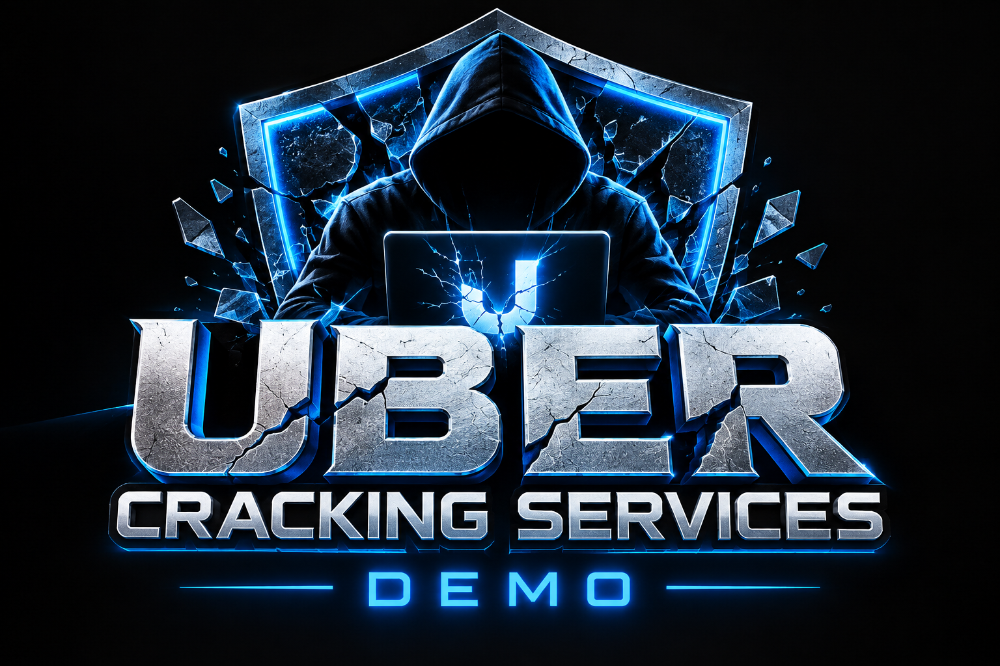
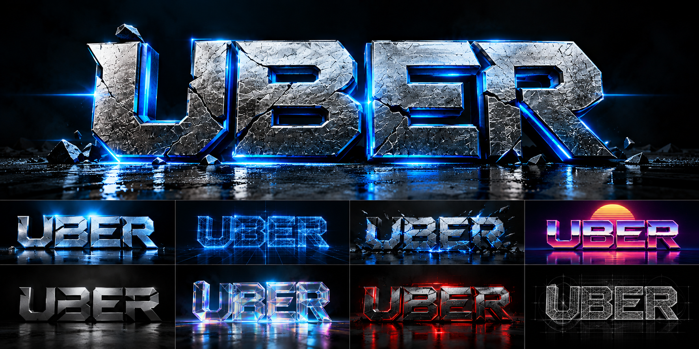
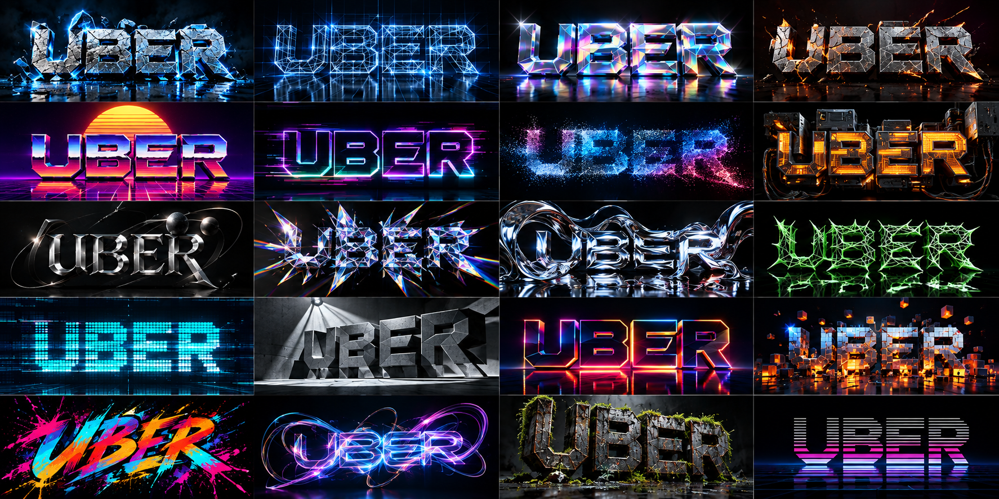

# macOS Impossible Wireframe

C++20 / OpenGL 4.1 Core wireframe demoscene for macOS, focused on mathematically unusual geometry, HDR-style shader compositing, and tracker-music-reactive motion. The project packages the audited impossible-wireframe design as a standalone public repo with tests, provenance, screenshots, and bundled demo music.

Copyright (c) 2026 Ulf Bertilsson. Code is MIT licensed.


## Screenshots





## Implemented scenes
The show now contains 51 validated scenes. Exact/derived scenes include the
600-cell projection, exact 600-cell face-plane slice and dual-derived 120-cell
projection. Parametric/numerical scenes include TPMS surfaces, Hopf fibres, Boy
surface, superformula, Clifford torus, quaternion-Julia boundary slice,
Lissajous and chaotic attractors, 25 v4 exotic geometry families and 10 ported
unknown-lab procedural wire objects.

`data/object_catalog.csv` records provenance. The hyperbolic and quaternion scenes are visualizations, not claimed canonical honeycomb/fractal meshes.

## Build
The build system is CMake. A `Makefile` wraps it for convenience — the
simplest path is just:

```sh
make            # configure + build (Release)
make test       # build + run the geometry/scroller tests
make run        # build + launch (default music, 132 bpm)
make run-pulse  # launch with the CC0 Wireframe Pulse track
make clean      # remove the build/ directory
```

Or use CMake directly (macOS via Homebrew):

```sh
brew install cmake glfw
cmake -S . -B build -DCMAKE_BUILD_TYPE=Release
cmake --build build -j
ctest --test-dir build --output-on-failure
./build/impossible_wireframe --bpm 132
```

Optional audio playback (libopenmpt + SDL2) is detected automatically; on
macOS add `brew install sdl2 libopenmpt`. Linux: install a C++20 compiler,
CMake, OpenGL development headers and GLFW3 development package, then use the
same commands (or `make`).

If OpenGL/GLFW are absent, CMake still builds `iw_geometry` and `geometry_tests`, allowing headless CI validation.

## Controls
- Left / Right: previous / next scene and enter manual scene mode
- Space: return to automatic beat/bar scene sequencing
- T: toggle the text scroller
- R: toggle the effect-recipe mode (auto per-scene mutation <-> a fixed curated recipe)
- Up / Down: in recipe mode, cycle the 24 curated effect recipes
- Escape: quit
- `--bpm N`: synchronization tempo (default 132)
- `--no-scroller`: start with the text marquee off (toggle back on with T)

## Visual layers
The renderer composites four layers, back to front:
1. **Logo backdrop** — the 20 `UBER_Fullscreen_Logo_Pack/UBER_*_1920x1080.jpg`
   cards as a full-screen texture. It crossfades as the scene changes and has a
   subtle Ken Burns zoom + beat-reactive brightness. Cards are found
   automatically relative to the executable (or CWD), so the folder just needs
   to sit next to the binary.
2. **Wireframe** — the 51 scenes with beat-reactive breathing scale, camera
   drift and morphing.
3. **Traveling objects** — 12 small octahedra weaving back and forth through
   the wireframe (depth-sorted, so they pass in front of and behind the mesh).
4. **Effect warp** — the CPU effect system (64 vertex-warper effects + 24
   curated multi-stage recipes + a deterministic procedural "mutation"
   generator) re-shapes the active mesh every frame, driven by the music
   pulse and synthetic bass/mid/treble/beat bands. In auto mode each scene
   gets its own deterministic mutation; press R for a fixed recipe and
   Up/Down to cycle. The system is fail-safe: any stage that leaves the mesh
   empty or invalid restores the previous frame, so a bad combo never blanks
   the scene.
5. **Screen-space FX (post pass)** — the Uber compositor's signature effects
   run over the combined logo + wireframe + travelers frame: gravitational
   lensing (1/r^2), a refractive shockwave ring, chromatic aberration, barrel
   breathing, an SDF nested-triangle energy sculpture, holographic spectral
   interference, beat-gated glitch slices, scanlines, film grain, and an ACES
   filmic tone map — all reactive to the beat/music level.
6. **Text scroller** — the beat-synced marquee of the active scene's name +
   provenance (on by default; toggle with T).

All layers are best-effort: if a shader fails to compile or the logo pack is
missing, the app degrades (no background / no travelers / no FX) rather than
crashing.

## Music

The repo includes Drozerix — **Silicon Dancer** (`MOD`), listed by the Quinlight Audio project as Public Domain, for immediate local playback. The fetcher can refresh the same file if needed:

```sh
python3 assets/music/fetch_other_music.py
./build/impossible_wireframe --music assets/music/drozerix_-_silicon_dancer.mod --bpm 132
```

When SDL2 and libopenmpt are available, the module plays locally and its decoded energy drives line glow, bloom intensity, timeline seconds, and background motion. Without those dependencies, the demo remains deterministic from its BPM clock.

## Correctness gates
Project targets compile with `-Wall -Wextra -Wpedantic -Werror` (or `/W4 /WX`). Tests assert canonical V/E/F counts for tesseract, 16-cell, 24-cell, 600-cell and V/E for the dual 120-cell; exercise every procedural family; reject non-finite vertices, invalid indices, self-edges and duplicate edges; and verify timeline beat/bar math.

## Architecture
- `Geometry.*`: canonical polychora, projections, slicing, base parametric surfaces, validation.
- `AdvancedGeometry.*`: TPMS extraction, dual 120-cell, quaternion boundary lattice, hyperbolic visualization, attractors, v4 exotic families, unknown-lab adapters and deterministic discovery.
- `Scene.*`: scene catalogue, provenance and update-rate cache. Expensive implicit/fractal geometry is not rebuilt at video refresh rate.
- `Timeline.*`: deterministic BPM/beat/bar synchronization.
- `Effects.*`: 64 CPU vertex-warper effects, 24 curated multi-stage recipes and
  a deterministic procedural recipe generator, driven by time + synthetic
  audio bands; fail-safe (restores the mesh on any invalid stage). Ported from
  the unknown-wireframe-lab v5/v6 compositor.
- `Renderer.*`: OpenGL 4.1 indexed line renderer with checked external GLSL compilation/linking, reusable buffers, RGBA16F HDR render target, shader composite, breathing size cycle, zoom/flyover camera choreography and guarded framebuffer setup. In logo mode the frame (logo + wireframe + travelers) is captured to the HDR target and passed through the post/FX shader.
- `shaders/post.*`: RGBA16F HDR-style composite pass with procedural background,
  glimmer, bloom-like highlight shaping, plus the Uber-compositor screen-space
  FX (gravitational lensing, refractive shockwave, chromatic aberration,
  barrel breathing, SDF triangle, holographic interference, glitch slices,
  scanlines, grain, ACES tone map) and music-reactive light.
- `shaders/wire.*`: object-space wire color cycling, lighting-matrix bands and
  music-reactive electric edge highlights.

See `design.md` for mathematical provenance and design constraints.
See `docs/EFFECTS.md` for the implemented effect catalogue.
